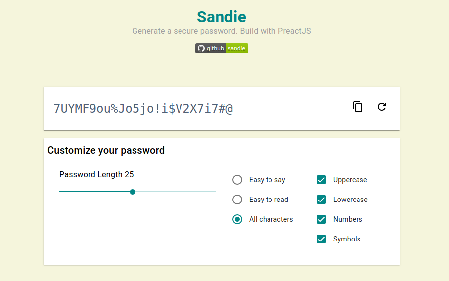

  <strong style="font-size:2em;">Sandie</strong> 
  Generate a secure password. Build with PreactJS

  

## Description
This application is only an experimental application. Made just for fun and to learn more about PreactJS.
This application also uses Parcel Bundle

## Password Format
For generate password we have 3 different format. They are

| Format  | Description |
| ------------- | ------------- |
| Easy to say  | avoid symbol and number to make it easy to say  |
| Easy to read  | Avoid ambiguous characters like 1, I, L, i, l, 0, o, O  |
| All characters  | Any characters combinations  |

## Screenshot

  

Inspired by
[LastPass Password Generator Tool](https://www.lastpass.com/password-generator)